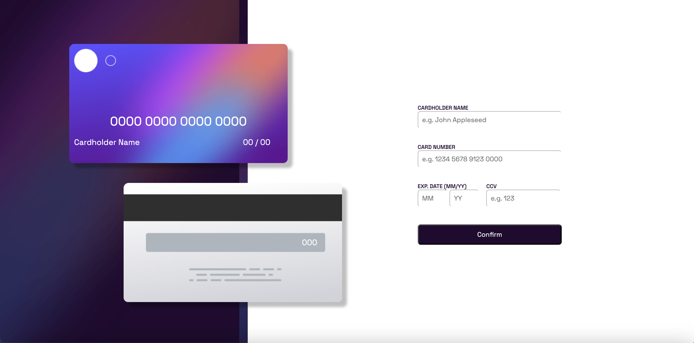

# Frontend Mentor - Interactive card details form solution

This is a solution to the [Interactive card details form challenge on Frontend Mentor](https://www.frontendmentor.io/challenges/interactive-card-details-form-XpS8cKZDWw). Frontend Mentor challenges help you improve your coding skills by building realistic projects.

## Table of contents

- [Overview](#overview)
  - [The challenge](#the-challenge)
  - [Screenshot](#screenshot)
  - [Links](#links)
- [My process](#my-process)
  - [Built with](#built-with)
  - [What I learned](#what-i-learned)
  - [Continued development](#continued-development)
  - [Useful resources](#useful-resources)
- [Author](#author)
- [Acknowledgments](#acknowledgments)

## Overview

### The challenge

Users should be able to:

- Fill in the form and see the card details update in real-time
- Receive error messages when the form is submitted if:
  - Any input field is empty
  - The card number, expiry date, or CVC fields are in the wrong format
- View the optimal layout depending on their device's screen size
- See hover, active, and focus states for interactive elements on the page

### Screenshot

### Links

- Solution URL: [Solution URL](https://www.frontendmentor.io/solutions/interactive-card-detail-o4j0TBSLsn)
- Live Site URL: [Live Site URL](https://el-torro71.github.io/Interactive-Card-Detail/)

## My process

### Built with

- Semantic HTML5 markup
- CSS custom properties
- Flexbox
- CSS Grid
- Mobile-first workflow
  <!-- - [React](https://reactjs.org/) - JS library -->
  <!-- - [Next.js](https://nextjs.org/) - React framework -->
- [Styled Components](https://styled-components.com/) - For styles

**Note: These are just examples. Delete this note and replace the list above with your own choices**

### What I learned

This project helped reinforce my naming convention and how I keep track of my tags, input values, etc.
In addition to a little practice with class manipulation.

<!-- If you want more help with writing markdown, we'd recommend checking out [The Markdown Guide](https://www.markdownguide.org/) to learn more. -->

### Continued development

For future projects I want to focus on project that are more javascript heavier. While I do enjoy creating and designing websites using HTML & CSS, I want to focus more and bringing my web apps to life.

### Useful resources

- [Bootstrap](https://getbootstrap.com/) - Bootstrap is a free and open-source CSS framework directed at responsive, mobile-first front-end web development.
- [MDN Web Docs](https://developer.mozilla.org/en-US/) -The MDN Web Docs site provides information about Open Web technologies including HTML, CSS, and APIs for both Web sites and progressive web apps.

## Author

Luis E Torres

- Website - [Luis Torres](https://el-torro71.github.io/Personal-Site/)
- Frontend Mentor - [@El-Torro71](https://www.frontendmentor.io/profile/El-Torro71)
- LinkedIn - [@luis-torres](https://www.linkedin.com/in/luis-torres-1706421b0/)

## Acknowledgments

While this was just a small personal project I wanted to take on, creating a working payment screen gave me a lot of confidence and what felt like real real experience in making a web app for a client.
